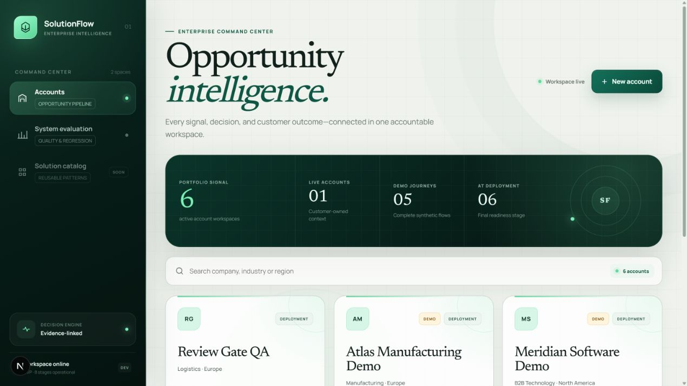
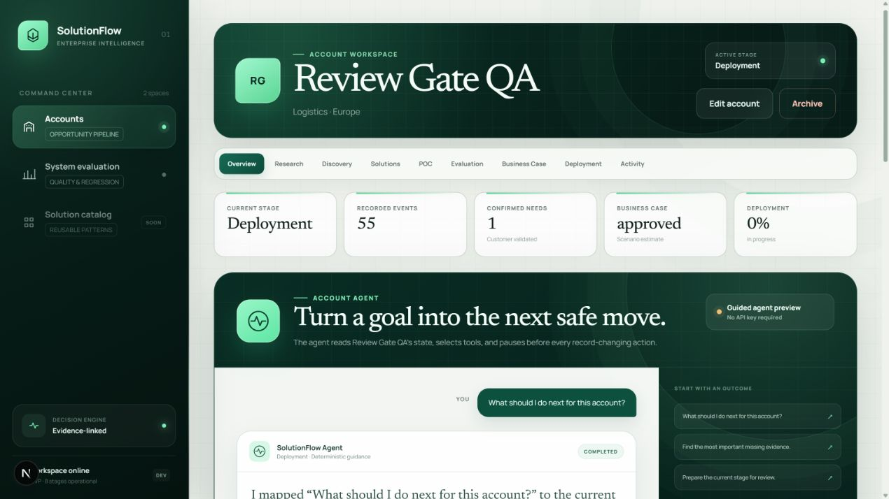
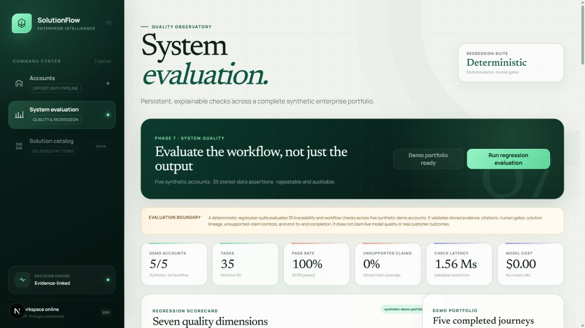

# SolutionFlow｜企业解决方案智能工作台

SolutionFlow 面向售前顾问、解决方案架构师与客户团队，把一个企业机会从“信息还很零散”推进到“可以做出上线决策”。系统将调研证据、客户访谈、需求确认、方案选择、POC、效果评估、商业测算和部署准备串成一条可追溯的业务链，并在关键节点保留人工审批。

它不是单纯的流程看板，也不是可以随意修改数据的聊天机器人。新增的 **Account Agent** 会理解用户目标、检查当前客户状态、调用受限工具、制定计划并建议下一步；一旦动作会创建或修改业务记录，Agent 就会暂停，等待用户明确批准。

> 当前状态：完整 MVP + Account Agent 已实现。前后端、数据库迁移、自动化测试和生产构建均已验证。

## 产品界面

### 机会工作台

统一查看全部客户、当前阶段与组合信号。界面采用深绿色企业视觉体系，让业务状态、决策入口与重点账户保持清晰一致。



### Account Agent

在客户页面直接输入业务目标。Agent 会读取账户信息、当前阶段和已有产物，给出观察、计划与一个明确的下一步动作，并展示实际使用过的工具轨迹。



### 系统评估

内置五个明确标记为合成数据的完整客户旅程，以及 35 项可重复数据库断言，用于检查引用、证据完整性、需求与方案血缘、人工审批和八阶段完成情况。



## 核心价值

| 业务问题 | SolutionFlow 的处理方式 |
| --- | --- |
| 客户信息散落，结论来源不清楚 | 保存来源、证据摘录、主张、置信度与人工核验状态 |
| 调研直接变成方案，缺少客户确认 | 强制保留“证据 → 假设 → 问题 → 回答 → 已确认需求”的链路 |
| 方案推荐像黑盒 | 使用确认需求进行可解释匹配，展示得分、匹配词与理由 |
| POC 结束后难以判断是否成功 | 预先锁定指标与阈值，再记录实测值并确定性计算结果 |
| ROI 数字容易被误当成真实收益 | 所有商业结果都标记为场景估算，并保存计算假设 |
| 上线准备靠口头同步 | 按安全、隐私、采购、集成、运营、治理六类检查责任人与证据 |
| Agent 可能越权或误操作 | 写操作必须人工批准，且仍由原有业务服务校验和执行 |

## Agent 是如何工作的

```text
用户目标
   ↓
读取客户、流程和阶段产物
   ↓
形成观察与执行计划
   ↓
提出一个符合当前阶段的动作
   ↓
只读/导航动作 ─────────────→ 直接完成
业务数据写入 ─→ 等待人工批准 ─→ 调用现有领域服务
   ↓
保存工具轨迹、审批与执行结果
```

Account Agent 是工作流之上的智能编排层：

- 可以理解自然语言目标，而不是要求用户寻找固定按钮。
- 只能使用白名单中的账户、工作流和阶段产物读取工具。
- 服务端会再次验证建议动作是否符合当前阶段。
- 不允许跳过八阶段流程，也不能替用户通过人工审核门。
- 每次运行、工具调用、建议、拒绝、批准与执行结果都会持久化。
- 没有 OpenAI Key 时自动使用确定性的 Guided 模式，方便本地开发与演示。

## 八阶段业务闭环

1. **Research｜企业调研**：模拟或实时 Web 调研，保存来源、证据与可核验主张。
2. **Opportunity｜机会假设**：从已审核证据生成机会假设，不把推断冒充客户事实。
3. **Discovery｜客户发现**：管理访谈问题与具名回答，将验证后的问题转成确认需求。
4. **Solution｜方案匹配**：对解决方案模式进行可解释排序，生成可编辑方案并保留需求血缘。
5. **POC｜验证计划**：定义范围、数据、架构、时间线、留出集、风险及成功指标。
6. **Evaluation｜效果评估**：记录真实指标值，计算通过/失败并做 Proceed、Iterate 或 Reject 决策。
7. **Business Case｜商业论证**：计算成本、节省、首年 ROI 和回收期，比较三种部署方案。
8. **Deployment｜部署准备**：形成上线运行计划，完成六类责任人和证据检查后才能结束流程。

## 技术架构

```text
浏览器
  │
Next.js 16 工作台
  │  同源 API 代理
FastAPI 领域 API
  ├─ Account Agent：读取工具 → 计划 → 人工审批 → 领域动作
  ├─ Research Provider：本地模拟 / OpenAI Responses API + Web Search
  └─ 八阶段领域服务与系统评估
  │
PostgreSQL 16
```

- **Next.js** 负责页面展示和浏览器交互。
- **FastAPI** 是唯一的业务规则边界，Agent 不能直接写数据库。
- **PostgreSQL** 保存客户、证据链、阶段状态、Agent 运行记录和审计事件。
- **Alembic** 管理数据库版本，当前迁移为 `20260903_0008`。

更详细的边界和数据血缘参见 [架构说明](docs/architecture.md)。原项目报告资料位于本地 `glm/`，该目录不会上传到 GitHub，也不参与运行。

## 快速开始

### 环境要求

- Node.js 20.9+
- Python 3.11+
- Docker Desktop，或兼容 PostgreSQL 16 的本地数据库

### 1. 安装依赖并启动数据库

```powershell
Copy-Item .env.example .env
npm install
python -m venv .venv
.\.venv\Scripts\python.exe -m pip install -e "apps/api[dev]"
docker compose up -d
```

### 2. 执行数据库迁移

```powershell
Set-Location apps/api
..\..\.venv\Scripts\python.exe -m alembic upgrade head
Set-Location ../..
```

### 3. 启动前后端

第一个终端：

```powershell
.\.venv\Scripts\python.exe -m uvicorn --app-dir apps/api app.main:app --reload
```

第二个终端：

```powershell
npm run dev:web
```

打开：

- 产品页面：[http://localhost:3000](http://localhost:3000)
- API 文档：[http://localhost:8000/docs](http://localhost:8000/docs)

本地 PostgreSQL 默认使用 `5433` 端口，避免与常见的 `5432` 安装冲突。

## OpenAI 配置

项目不要求 API Key 也可以运行。默认调研使用本地模拟，Account Agent 使用 Guided 模式。

如需启用实时能力，只在被 Git 忽略的本地 `.env` 中填写：

```dotenv
# 真实 Key 仅保存在本地，切勿提交到 Git。
OPENAI_API_KEY=

# 企业调研
RESEARCH_PROVIDER=mock
OPENAI_RESEARCH_MODEL=gpt-5.4-mini

# Account Agent：有 Key 时自动使用 OpenAI，否则使用 Guided 模式
AGENT_PROVIDER=auto
OPENAI_AGENT_MODEL=gpt-5.6-luna
```

修改后重启 FastAPI。设置 `AGENT_PROVIDER=guided` 可强制本地模式，设置为 `openai` 则要求实时提供方必须可用。

## 数据与安全边界

- `.env`、虚拟环境、构建产物和 `glm/` 报告资料均已加入 `.gitignore`。
- OpenAI Key 只由 FastAPI 服务端读取，不会发送到浏览器。
- 演示客户、网站、访谈回答、POC 结果和 ROI 数据全部是合成数据。
- 实时调研只保存能够关联返回来源 URL 的主张。
- 关键阶段需要人工审核；Agent 不能自行替用户批准。
- 当前项目不是生产合规认证，也不会自动创建真实云基础设施。

## 验证命令

后端：

```powershell
Set-Location apps/api
..\..\.venv\Scripts\python.exe -m pytest
..\..\.venv\Scripts\python.exe -m ruff check app tests migrations
```

前端：

```powershell
npm run lint:web
npm run typecheck:web
npm run test:web
npm run build:web
```

当前验证结果：后端 **38 项测试通过**；前端测试、Lint、TypeScript 检查与生产构建通过；系统评估为 **35/35**。

## 主要目录

```text
apps/
  api/
    app/modules/
      accounts/       客户、流程与活动记录
      agent/          目标规划、工具轨迹、审批与动作执行
      research/       调研、来源、证据与审核
      discovery/      假设、问题、回答与确认需求
      solutions/      方案目录、匹配、提案与审核
      poc/            POC 计划、指标与决策
      business_case/  ROI、部署比较、简报与审核
      deployment/     上线计划、准备检查与完成门
      evaluation/     合成组合与确定性系统评估
    migrations/       Alembic 数据库迁移
    tests/            API 与领域集成测试
  web/
    app/               Next.js 页面与 API 代理
    components/        产品界面组件
    lib/               API 客户端、类型与辅助逻辑
docs/images/           README 产品截图
compose.yaml           本地 PostgreSQL
```

## 当前边界与后续方向

当前版本已经完成从调研到部署准备的可运行闭环，并加入受控 Account Agent。下一阶段更适合投入生产化能力，包括：身份认证与权限、真实 CRM/知识库连接器、实时模型评估、可观测性、限流、备份恢复、CI/CD、基础设施部署以及正式安全评审。
