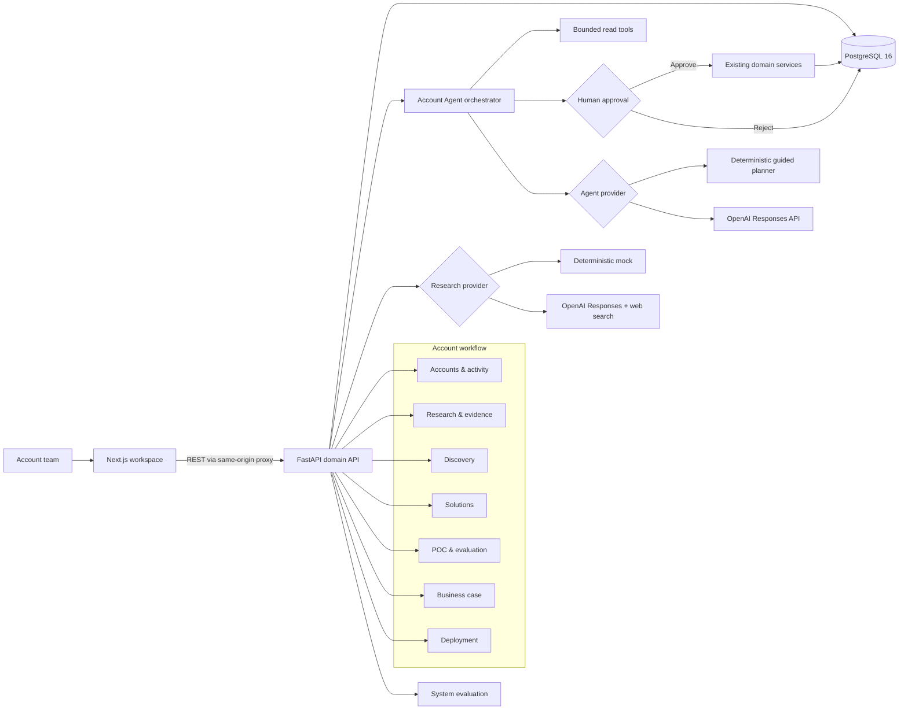
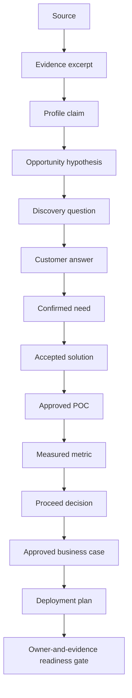

# SolutionFlow architecture

SolutionFlow is a traceable enterprise account workflow with a bounded account-level agent. Next.js renders the workspaces, FastAPI owns every domain rule and human gate, and PostgreSQL stores the business graph, agent runs, and audit trail.

## Runtime architecture

The browser never receives the OpenAI key. Optional live providers run inside FastAPI, while deterministic research and agent modes remain available for local development and tests.

## Agent control boundary

The Account Agent is an orchestration layer over the workflow, not an alternative data model. A run starts with a user goal, inspects account, workflow, and current-stage artifacts through allow-listed read tools, and returns observations, a short plan, and exactly one next action. The server validates that action against the current workflow stage.

Safe navigation actions can complete directly. Actions that create or change business data enter `awaiting_approval`; approval resumes the same persisted run and invokes an existing domain service. Rejection and execution results are also persisted. The agent cannot skip workflow stages, approve human review gates, or write directly to PostgreSQL.

## Evidence and decision lineage

Every material mutation also creates an `activity_events` record. Human approval is required at Research, Discovery, Solution, POC, Evaluation, Business Case, and Deployment boundaries.

## Phase 7 evaluation boundary

The system evaluation uses five clearly marked synthetic demo accounts and 35 deterministic database assertions. It checks research grounding, citation coverage, evidence completeness, hypothesis and solution lineage, unsupported-claim controls, and complete workflow progression.

This suite is a product-regression benchmark. It does not represent live-model factual accuracy, production latency, realized customer value, or compliance certification. Live model comparisons can be added later as a separate dataset and evaluation run type.

## Deployment boundary

The Deployment workspace produces an accountable operating plan and readiness record. It does not provision cloud infrastructure. A completed plan means all six readiness owners supplied evidence and the workflow is authorized to proceed to a real production launch process.
