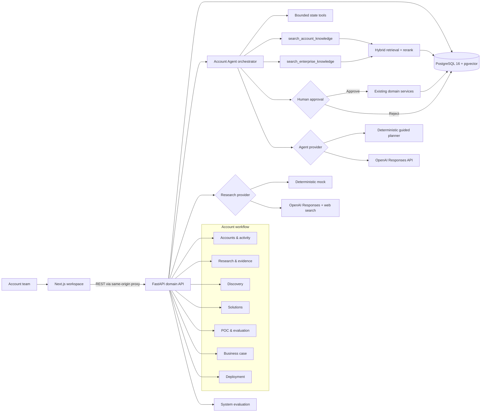
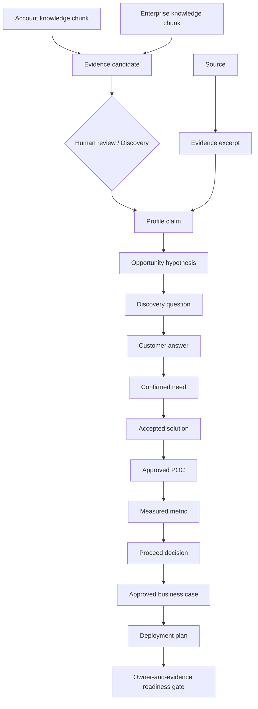

# SolutionFlow architecture

SolutionFlow is a traceable enterprise account workflow with a bounded, knowledge-grounded account agent. Next.js renders the workspaces, FastAPI owns every domain rule and human gate, and PostgreSQL with pgvector stores the business graph, knowledge index, agent runs, and audit trail.

## Runtime architecture

The browser never receives the OpenAI key. Optional live providers run inside FastAPI, while deterministic research and agent modes remain available for local development and tests.

## Unified knowledge boundary

`knowledge_documents` and `knowledge_chunks` share one ingestion and indexing implementation. A database check constraint enforces the namespace invariant:

- `account`: `account_id` is required and every query is pinned to the current account.
- `enterprise`: `account_id` must be null and the document may be shared across accounts.

Only active documents are searchable. New uploads with the same source name create a new version and supersede the previous active version. PDF pages and Markdown / DOCX headings become chunk locators; document and chunk metadata preserve scope, type, industry, region, product, deployment mode, confidentiality, effective date, source file, version, page, and section.

PostgreSQL uses a 384-dimensional pgvector column with an HNSW cosine index and a GIN full-text index. Retrieval unions dense and keyword candidates after applying account, scope, status, and metadata filters. A deterministic reranker combines vector similarity, BM25-style token relevance, metadata matches, and exact phrase matches. With no API key, feature-hash embeddings keep the complete local demo operational. With a key, the same 384-dimensional column can use OpenAI embeddings and grounded Responses API answers.

## Agent control boundary

The Account Agent is an orchestration layer over the workflow, not an alternative data model. A run starts with a user goal, inspects account, workflow, and current-stage artifacts, then calls the two explicit knowledge tools. Both tool results, retrieval scores, and selected citations are persisted in the run trace. The agent returns observations, a short plan, and exactly one next action. The server validates that action against the current workflow stage.

Safe navigation actions can complete directly. Actions that create or change business data enter `awaiting_approval`; approval resumes the same persisted run and invokes an existing domain service. Rejection and execution results are also persisted. The agent cannot skip workflow stages, approve human review gates, or write directly to PostgreSQL.

## Evidence and decision lineage

Every material mutation also creates an `activity_events` record. Human approval is required at Research, Discovery, Solution, POC, Evaluation, Business Case, and Deployment boundaries.

Knowledge retrieval never writes a confirmed business fact. A grounded answer persists immutable citation snapshots as `knowledge_evidence_candidates`; reviewing one changes only its candidate status. Converting evidence into a claim, hypothesis, or confirmed need remains the responsibility of the existing evidence and Discovery gates.

When a user approves an Agent write action, its persisted `action_result` records `derived_from_evidence_ids` and the resulting entity identity. This supplies generic lineage for Research, Solution, POC, Business Case, and Deployment artifacts created through the Agent without allowing knowledge retrieval to mutate those artifacts directly.

Retrieved document text is treated as untrusted reference data. The live prompt forbids following instructions inside chunks, requires exact citation IDs for material claims, and uses `store=False`. Only top-k excerpts are sent to the answer model rather than the complete knowledge library.

## Phase 7 evaluation boundary

The system evaluation uses five clearly marked synthetic demo accounts and 35 deterministic database assertions. It checks research grounding, citation coverage, evidence completeness, hypothesis and solution lineage, unsupported-claim controls, and complete workflow progression.

This suite is a product-regression benchmark. It does not represent live-model factual accuracy, production latency, realized customer value, or compliance certification. Live model comparisons can be added later as a separate dataset and evaluation run type.

## Deployment boundary

The Deployment workspace produces an accountable operating plan and readiness record. It does not provision cloud infrastructure. A completed plan means all six readiness owners supplied evidence and the workflow is authorized to proceed to a real production launch process.
